### Topic Modelling

A topic model is a kind of statistical model that is used to uncover hidden structure
within a collection of texts. The topics are the primary subjects discussed in a
document. Intuitively, a paper is about a certain subject, and those subject terms
occur more often than others. For instance, in sports news, terms such as "players,"
"games," and "scores" will appear more often, but in technological news, terms such
as "tech," "artificial," and "smart" will appear more frequently. The words "the," "a,"
and "if" will occur practically identically across the publications.On the basis of these
topic proportions, a topic model is constructed. A topic is a group of related words.
Each term in the paper is derived from a certain subject. Thus, a document is just
a collection of issues with varying degrees of importance. There are several topic
modelling models****

Recently, the topic model, a probabilistic generative model with a particular emphasis
on text mining and information retrieval (e.g., identifying abstract subjects
from a collection of texts), has gained prominence. Table 1 is showing application
of different topic model in many different corpora. There are a variety of approaches
for extracting topics from a document repository. Latent semantic Analysis (LSA) is one of the oldest approaches for decomposing a document term matrix into a document-topic matrix and a topic-term matrix via singular value decomposition
(SVD). Probabilistic Latent Semantic Analysis, on the other hand, generates conclusions
using a probabilistic model rather than an SVD (Deerwester et al., 1990). One of
the significant disadvantages of LSA is that it requires a large number of documents
to obtain precise findings, whereas PLSA is exceptionally prone to overfitting. Due
of the ease with which Latent Dirichlet Allocation (LDA) may be normalized to new
documents, it performs better than PLSA.


```python
from IPython.display import Image
Image(filename='models.png')
```


    
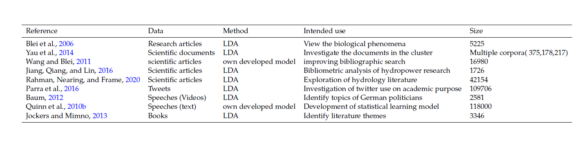
    


### Latent Dirichlet Allocation (LDA)
I have chosen Latent Dirichlet Allocation (LDA) as topic modeling method,
since it is the most widely used, state-of-the-art, and simplest method (Blei et al.,
2003). While additional topic modelling techniques may be investigated, the purpose
of this study is to facilitate researchers’ usage of topic modelling in order to
extract organized information. For researchers, simplicity of use and application are
critical, with LDA being simple to adopt and understand. Other topic modelling
techniques might be included into the framework; studies of other topic models are
available in (Alghamdi and Alfalqi, 2015).

Latent Dirichlet Allocation (LDA) is based on the underlying assumptions of the
distributional hypothesis, (i.e. similar topics consist of similar terms) (Wishart and
Prokopidis, 2017)and the statistical combination hypothesis (i.e. documents talk about several topics) for which a statistical distribution can be determined (Chen
and Li, 2009). A primary goal of LDA is to assign a topic to each document in our
corpus based on the content’s words. Figure 2 illustrates the intuition behind LDA.


```python
from IPython.display import Image
Image(filename='lda_work.png')
```


    
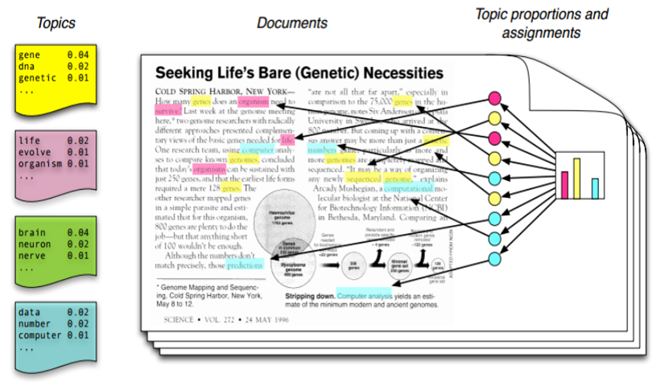
    


### Workflow

The Figure 3 depicts the thesis’s work flow, from data collection through web of
science sources to performance evaluation using statistical methods applied to LDAderived
topic distributions. After gathering data from the server, we used the LDA
algorithm to train the model. Following that, the models were evaluated by varying
the LDA parameters to determine the optimum model. Finally I use LDA derived
topic distribution to analyze and visualize the result. This chapter will outline the
methods used to carry out these various operations.


```python
from IPython.display import Image
Image(filename='workflow.jpg')
```


    
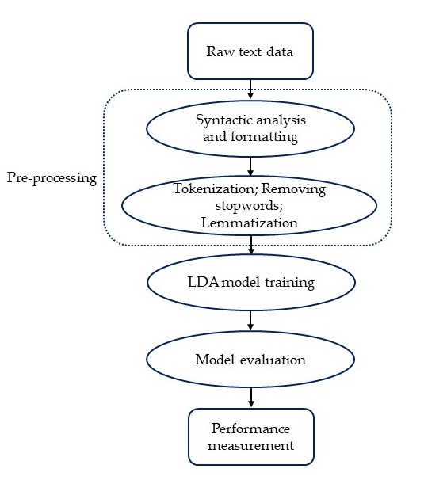
    


### Data Retreival 

Web of Science is a centralized research tool that connects multiple databases that
contain extensive and comprehensive journal meta data. It covers more than 8,500
notable journals encompassing 150 disciplines from 1900 to present day. We used
the Web of Science core set as the data source, selected various types of literature,
and indicated the advanced retrieval type ( Ti= hydrology and flood). The format
we have selected for downloading is Microsoft Excel. Web of Science has a very user friendly interface to download and
retrieve data into different format.We used there website to download the data.I
have downloaded total 11,187 articles metadata from the year 1939 to 2021 which
was illustrated by Figure 4.


```python
from IPython.display import Image
Image(filename='numberofarticles_1.png')
```


    
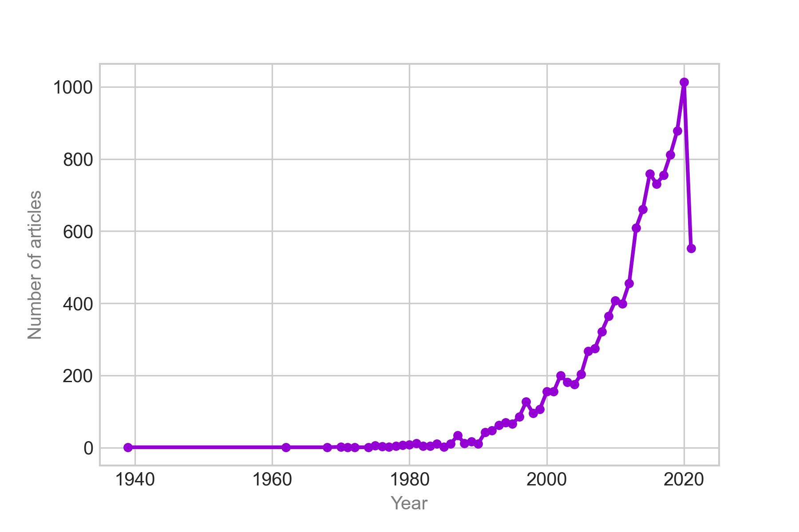
    


### Preprocessing

I used a single dataframe that had been temporally
sorted for abstracts, keywords, and titles. The complete dataframe has been cleaned
on various layers. We concatenated all words from abstracts, keywords, and titles
into a single series and applied it to the entire corpus. We then filtered out nonsensical
words and elements such as stopwords, punctuation, and symbols, in addition to
manually identifying and removing undesirable elements. We then formed bi and
trigrams and segmented the texts using whitespace as word boundaries, followed
by lemmatization to normalize to a canonical format. The output of the analysis
was converted to a term frequency-inverse document frequency (TF-IDF) format for
incorporation into the LDA model implemented in Gensim- a Python library for
Natural Language Processing (NLP) (Rˇ ehu˚ rˇek and Sojka, 2010).

Here are the steps in pre-processing that could be necessary in all kinds of text mining
algorithms:

1. Removal of punctuation, number, white spaces and other unnecessary terms
2. Tokenization
3. Conversion to lower-case
4. Removal of stopwords
5. Lemmatization
6. Bigram and trigram formation


```python
from IPython.display import Image
Image(filename='preprocess.jpg')
```


    
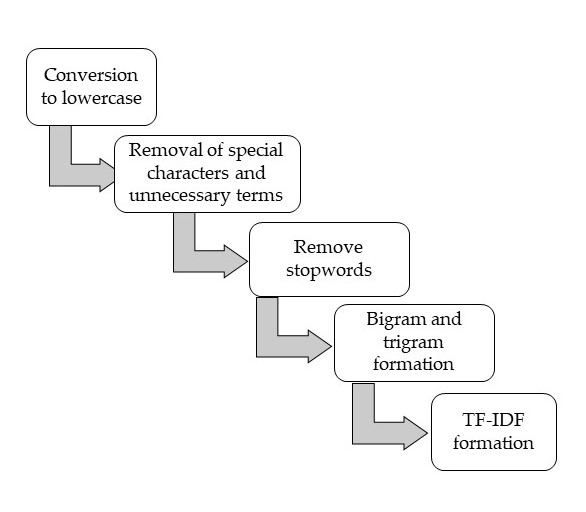
    


# Analysis

### Selecting optimal number of topics

I trained LDA models using identical hyperparameters for a range of topics numbers
from K = 2 to K = 30, logging the coherence c and perplexity p scores for each
K. The resulting scores are plotted in Figure 5. To determine Kopt, we considered a range of number of topics K for which coherence c peaks, accompanied by a decreasing
trend for perplexity plot - i.e., K = 7 to K = 30. After analysing several models
with different k values, we can see on Figure 6 that documents per topic changes
as number of topics(k) increases.


```python
from IPython.display import Image
Image(filename='perplexity-coherence.jpg')
```


    
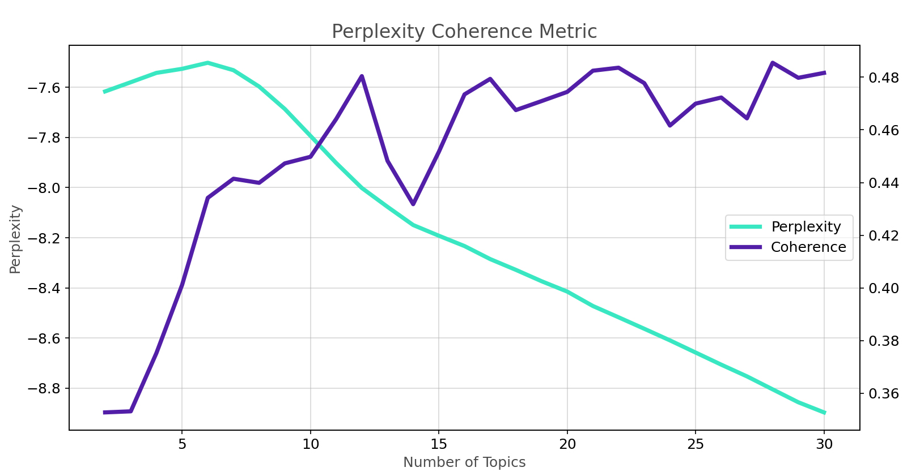
    


```python
## Topic Naming

from IPython.display import Image
Image(filename='pylda.png')
```


    
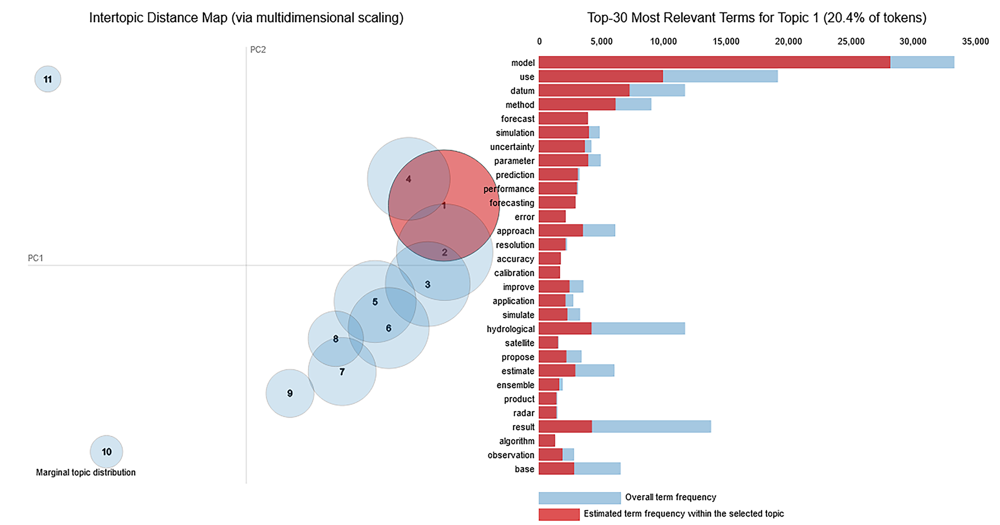
    


For interactive Visulaization Please follow this link:

## Results

### Sankey Diagram
FIGURE 3.4: Evolution of topics with increasing number of topics K. Lines in the Sankey diagram represent papers shared by each topic
(at different topic numbers), where each paper is weighted by the relative proportion of inclusion in the sending topic (i.e., the topic at the
smaller number of topics)


```python
from IPython.display import Image
Image(filename='sankey.png')
```


    
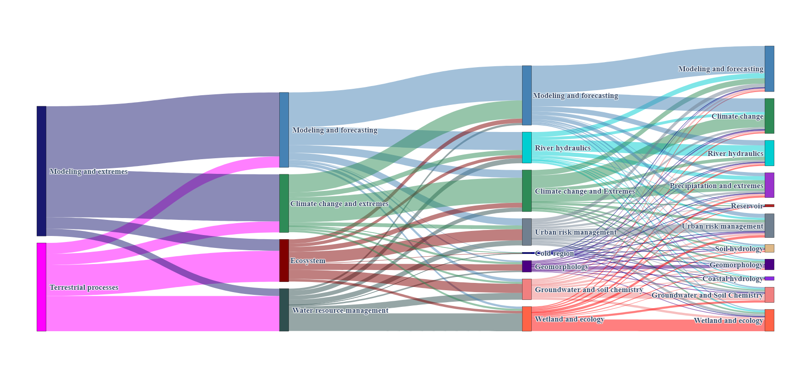
    


```python
from IPython.display import Image
Image(filename='topicwordclouds.png')
```


    
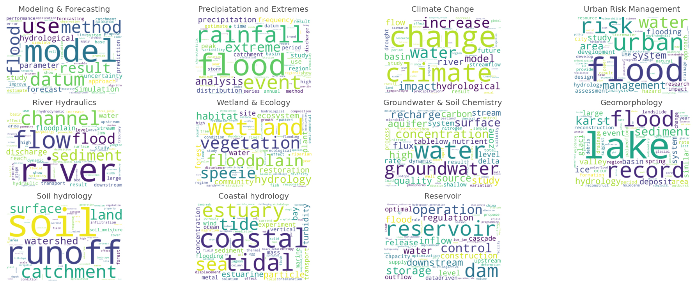
    


```python
from IPython.display import Image
Image(filename='trends.png')
```


    
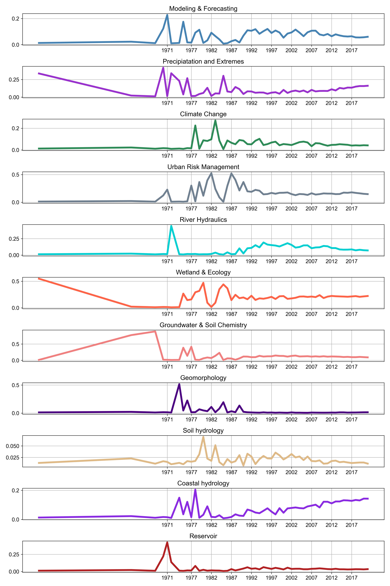
    


```python
from IPython.display import Image
Image(filename='relativetopic.png')
```


    
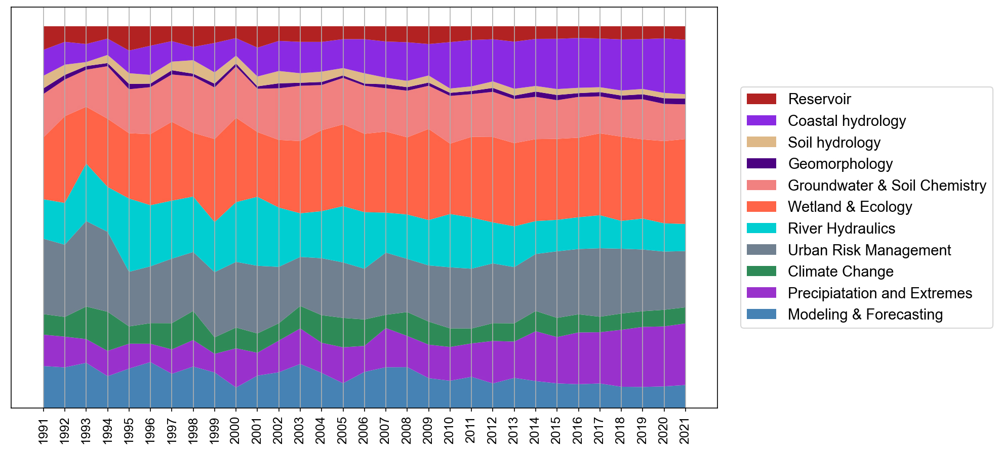
    


```python
from IPython.display import Image
Image(filename='nchorddigram.png')
```


```python

```
